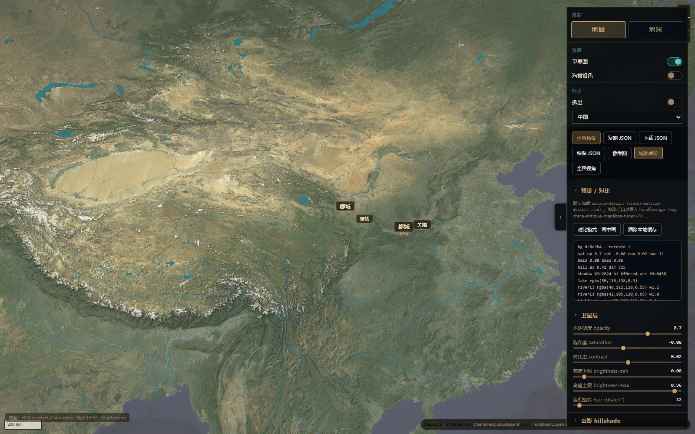
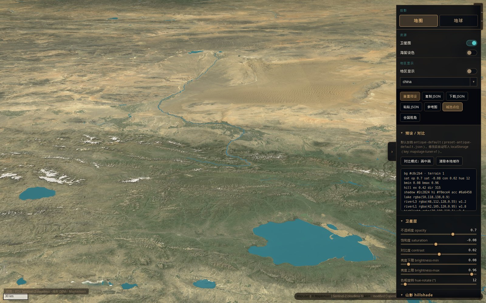
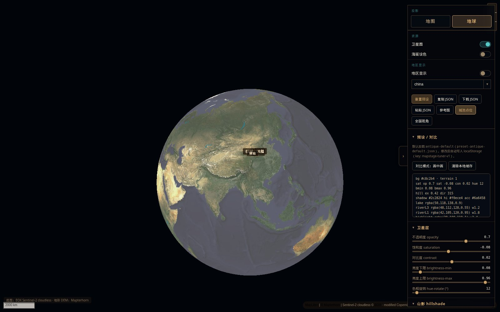
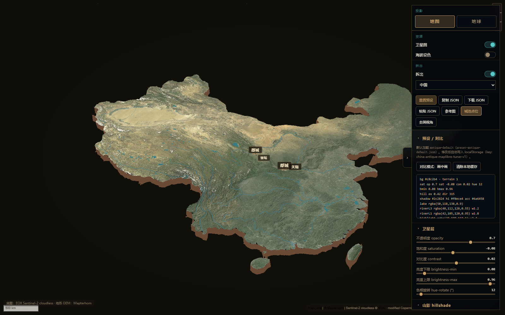

# MapStage

[English](README.md) | **中文**

开源 **MapStage 调参器**：地图 / 地球投影、卫星底图、海拔设色、三维地形、区域拆出，参数可导出 JSON。

## 在线演示

**→ https://hopechen067.github.io/MapStage/**  
交互调参器（EOX 卫星底图 + Mapterhorn 地形需联网。无需安装。）

## 更新说明

- **地图 / 地球** 投影切换；卫星与海拔设色互相独立；可选区域拆出（独立地形块）。
- 山影与三维地形改为 **Mapterhorn** DEM（原先为 AWS Terrarium）。
- 水系为内置 OpenFreeMap / OpenMapTiles 矢量水。
- 色调滤镜可开关；复制 JSON 含当前相机与资源开关。
- 开源仓库更名为 **MapStage**。

## 效果展示

当前调参器：全国地图、三维地形、地球、拆出。

<table>
  <tr>
    <td align="center" width="50%">
      
      <br /><sub>调参器 · 全国 / 地图投影</sub>
    </td>
    <td align="center" width="50%">
      
      <br /><sub>调参器 · 三维地形</sub>
    </td>
  </tr>
  <tr>
    <td align="center" width="50%">
      
      <br /><sub>调参器 · 地球</sub>
    </td>
    <td align="center" width="50%">
      
      <br /><sub>调参器 · 拆出</sub>
    </td>
  </tr>
</table>

| 项目 | 说明 |
|------|------|
| Skill 目录 | `mapstage` |
| 运行时 | MapStage |
| 默认底图 | **EOX Sentinel-2 cloudless**（公开演示 WMTS，请自行遵守图源条款） |
| 地形 / 山影 | **Mapterhorn** DEM（运行时拉取；Terrarium 编码） |
| 水系 | OpenFreeMap / OpenMapTiles 矢量水 |
| 风格 | 色调滤镜、地图/地球、拆出地形块、`HanCity3D` 城池 |
| 许可证 | 代码/文档 [MIT](LICENSE)；展示媒体与第三方条款见 [LICENSE-EXCEPTIONS.md](LICENSE-EXCEPTIONS.md) / [NOTICE.md](NOTICE.md) |
| 在线演示 | [在线演示](https://hopechen067.github.io/MapStage/) — Pages 将 `mapstage/tuner` 发布到站点根路径 |

## 快速拉取（安装）

**`git clone` 拉的是整个仓库，不是单独的 skill。**  
克隆后得到 README、showcases、调参器，以及 `mapstage/` skill 目录。Agent 不会从仓库根目录自动发现这份 skill。要用 skill，再把 `mapstage/` 复制到 skills 目录（第 2 步）。

### 1）克隆仓库

```bash
git clone https://github.com/hopechen067/MapStage.git
cd MapStage
```

之后更新：

```bash
cd MapStage
git pull
```

### 2）安装为 Agent Skill（复制目录）

Skill 本体在 `mapstage/` 文件夹。把它复制到你的 agent skills 目录，然后重载 skills。

**Windows（PowerShell）** — 按你用的宿主选路径：

```powershell
# Grok 等常用用户 skills 目录
$src = ".\mapstage"
$dst = Join-Path $env:USERPROFILE ".grok\skills\mapstage"
New-Item -ItemType Directory -Force -Path (Split-Path $dst) | Out-Null
Copy-Item -Recurse -Force $src $dst
```

```powershell
# Codex 用户 skills（若你用 Codex）
$src = ".\mapstage"
$dst = Join-Path $env:USERPROFILE ".codex\skills\mapstage"
New-Item -ItemType Directory -Force -Path (Split-Path $dst) | Out-Null
Copy-Item -Recurse -Force $src $dst
```

**macOS / Linux：**

```bash
git clone https://github.com/hopechen067/MapStage.git
cp -R MapStage/mapstage ~/.grok/skills/mapstage
# 或：~/.codex/skills/mapstage
```

一条命令（Unix：克隆 + 装 skill）：

```bash
git clone --depth 1 https://github.com/hopechen067/MapStage.git \
  && cp -R MapStage/mapstage ~/.grok/skills/mapstage
```

### 3）复制给 Agent 的话术

```text
请使用 MapStage skill。
在线调参：https://hopechen067.github.io/MapStage/
仓库：https://github.com/hopechen067/MapStage
我会在 demo 里调好风格后导出 JSON，请按 SKILL.md / references 应用到地图场景（jumpTo + idle，encoding terrarium）。
```

风格流程：打开 [在线演示](https://hopechen067.github.io/MapStage/) → 调参 → **复制 JSON** → 粘贴给 agent。

## 快速开始（本机调参）

仅在你要**本机离线**跑调参器时需要；用公网 demo 可跳过。

```bash
cd mapstage/tuner

# 方式 A — Python 3
python -m http.server 8765

# 方式 B — Node
npx --yes serve -l 8765
```

服务启动后在本机打开：`http://127.0.0.1:8765/`  
公网分享请用 [在线演示](#在线演示)。

**不要**用 `file://` 打开 `index.html`。

可选检查：

```bash
cd mapstage/tuner
node verify.mjs
```

## 功能

- **可配置栅格底图** — 默认 [EOX Sentinel-2 cloudless](https://s2maps.eu)；其他源用 gitignore 的 `map-tiles.config.local.js`。
- **Mapterhorn 山影 + 三维地形** — Terrarium 编码；地图/地球投影；可选区域拆出。
- **矢量水系** — OpenFreeMap / OpenMapTiles（内置）。
- **色调滤镜** — sepia / 暖调 / 暗角 / 画笔；滤镜可关；导出 JSON 预设。
- **城池分级** — 都城 / 大城 / 中城 / 小城 / 关隘 / 驿站 / 都护等。

## 配置地图瓦片

1. 阅读 [NOTICE.md](NOTICE.md)。
2. 默认：`tuner/map-tiles.config.js`（EOX + Mapterhorn）。
3. 个人端点：`map-tiles.config.local.js`（不提交）。见 `map-tiles.config.example.js`。

EOX 公共瓦片多为非商用 + 需署名（约 10 m）。本项目不授予任何商业图商权利。

## 瓦片不随仓库打包

卫星与 DEM 仅在运行时按配置请求。

## 署名与合规

- 遵守所用底图 / DEM / CDN 条款。
- 矢量水系需保留 **OpenFreeMap / OSM** 署名。
- **第三方运行时：** 再分发时遵循其许可证 — [NOTICE.md](NOTICE.md)。
- **展示图：** 默认保留权利的演示媒体（见 [LICENSE-EXCEPTIONS.md](LICENSE-EXCEPTIONS.md)）。

## 安装为 Agent Skill

GitHub 仓库是完整项目。Skill 只是其中的 **`mapstage/`** 目录。

1. 将 `mapstage` 复制到 skills 目录（Grok：`~/.grok/skills/mapstage`）。  
2. 重载 skills，使 `SKILL.md` 生效。  
3. 让 agent 打开调参器、套用导出的 JSON 预设（version 3），或把同一套外观接到 MapStage 场景。

## 目录结构

```
.
├── LICENSE
├── LICENSE-EXCEPTIONS.md      # 展示媒体 / 第三方 / 自备地理数据（非 MIT）
├── NOTICE.md
├── DATA-PROVENANCE.md
├── SECURITY.md
├── README.md / README.zh-CN.md
├── showcases/                 # 文档用截图与示例帧
└── mapstage/
    ├── SKILL.md
    ├── agents/openai.yaml
    ├── references/
    ├── schemas/
    └── tuner/                 # 发布到 GitHub Pages 站点根路径
```

## 贡献 / 安全

- 优先小而清晰的改动。  
- 勿提交 API key 或 `map-tiles.config.local.js`。  
- 见 [SECURITY.md](SECURITY.md)。

## 延伸阅读

- [`mapstage/SKILL.md`](mapstage/SKILL.md)  
- [`mapstage/references/参数列表说明.md`](mapstage/references/参数列表说明.md)  
- [`mapstage/references/tuner-workflow.md`](mapstage/references/tuner-workflow.md)  
- [`mapstage/references/tested-config.md`](mapstage/references/tested-config.md)  
